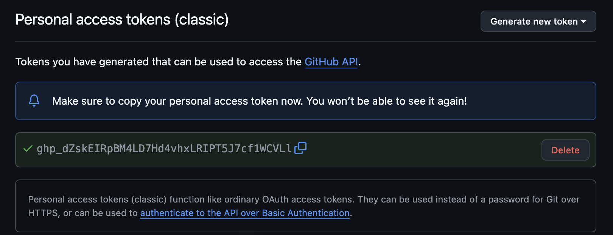
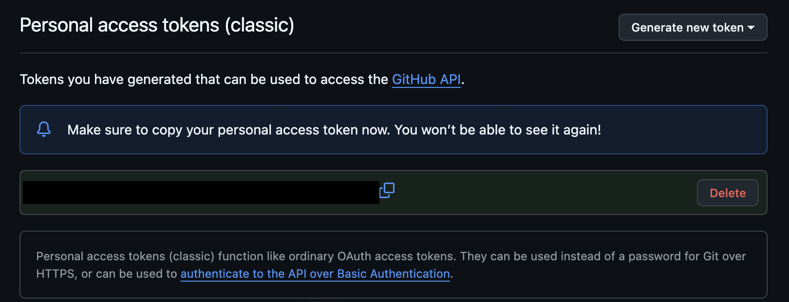

<div align="center">


# eyesoff

**Let your coding agent set up API keys without ever seeing them.**

<br>


[](https://github.com/Teeermi/eyesoff/actions/workflows/ci.yml)

</div>

<br>

<div align="center">
  
  <br>
  <br>
  <a href="https://github.com/Teeermi/eyesoff/raw/main/assets/demo.mp4"><b>▶ Download the 1-minute demo</b></a> (MP4, 6 MB): installing the plugin, setting it up, and Claude creating a GitHub token it never sees.
</div>

<br>

<p align="center">
A small local proxy between Claude Code and the Anthropic API.<br>
It strips secrets out of text and screenshots before anything leaves your machine.
</p>

<br>

<div align="center">

## Quick start

</div>

Install the plugin in Claude Code:

```
/plugin marketplace add Teeermi/eyesoff
/plugin install eyesoff@eyesoff
```

Then tell Claude:

```
set up eyesoff
```

Claude downloads the eyesoff binary, starts the proxy and points Claude Code at it in `~/.claude/settings.json`. Claude Code starts using the proxy right away, even in sessions that are already open. Restart it once so the plugin can give Claude the rules for handling keys. From then on the plugin starts the proxy when a session begins, in case it isn't running, and hands Claude those rules.

<br>

---

<br>

<div align="center">

## Features

</div>

<table align="center">
<tr>
<td width="50%" valign="top">

### Text
- Catches 57 known key formats from Stripe, GitHub, OpenAI, AWS and others, listed in [`prefixes.txt`](prefixes.txt)
- Also catches long random strings with digits and mixed case that have no known prefix
- `cat .env` comes back as `STRIPE_SECRET_KEY=[hidden by eyesoff]`

### Screenshots
- Reads the image on your Mac with the Vision framework and draws a black box over anything that looks like a key, including a key that wraps onto a second line
- Replaces a screenshot it can't check with a note instead of sending it

</td>
<td width="50%" valign="top">

### Pasting keys
- `eyesoff paste NAME --env .env` writes the clipboard into a file and clears the clipboard. The model only sees `STRIPE_SECRET_KEY saved to .env (107 chars), clipboard cleared`
- `eyesoff paste NAME -- command` pipes the clipboard into a command's stdin

### Setup
- One Rust binary, tested in CI on macOS, Linux and Windows
- Works with a claude.ai subscription login, so you don't need an API key
- If eyesoff isn't running, Claude Code can't reach the API at all

</td>
</tr>
</table>

<br>

---

<br>

<div align="center">

## How it works

</div>

<br>

<table align="center">
<tr>
<td align="center" width="50%">
  
  <br>
  <strong>What Claude Code captures</strong>
</td>
<td align="center" width="50%">
  
  <br>
  <strong>What the model receives</strong>
</td>
</tr>
</table>

<br>

<div align="center">


</div>

<br>

1. You: "create a restricted Stripe key and add it to .env as STRIPE_SECRET_KEY".
2. The agent opens the dashboard and creates the key. The screenshot it takes has the key covered before it leaves your machine.
3. The agent clicks Copy. The key is now in your clipboard, and the model has no view of that.
4. The agent runs `eyesoff paste STRIPE_SECRET_KEY --env .env`. eyesoff writes the clipboard into the file, clears the clipboard and prints `STRIPE_SECRET_KEY saved to .env (107 chars), clipboard cleared`. That line is all the model gets back.
5. If the agent reads `.env` later, it sees `STRIPE_SECRET_KEY=[hidden by eyesoff]`.

<br>

---

<br>

<div align="center">

## Install without the plugin

</div>

**macOS and Linux**

```sh
curl -fsSL https://raw.githubusercontent.com/Teeermi/eyesoff/main/install.sh | sh
```

**Debian and Ubuntu**

```sh
curl -fsSLo /tmp/eyesoff.deb https://github.com/Teeermi/eyesoff/releases/latest/download/eyesoff_$(dpkg --print-architecture).deb && sudo apt install /tmp/eyesoff.deb
```

**Windows** (PowerShell)

```powershell
irm https://raw.githubusercontent.com/Teeermi/eyesoff/main/install.ps1 | iex
```

**From source**

```sh
cargo install --git https://github.com/Teeermi/eyesoff
```

Start the proxy and leave it running:

```sh
eyesoff start
```

Point Claude Code at it in `~/.claude/settings.json`:

```json
{
  "env": {
    "ANTHROPIC_BASE_URL": "http://127.0.0.1:8787"
  },
  "permissions": {
    "deny": ["Bash(pbpaste *)"]
  }
}
```

Tell the agent how to handle keys, for example in `~/.claude/CLAUDE.md`:

```
Never print or read secret values, and never read the clipboard.
To store a key from a web dashboard, click its Copy button and run
`eyesoff paste NAME --env .env`. To send it to a command that reads stdin,
run `eyesoff paste NAME -- <command>`, e.g. `eyesoff paste API_TOKEN -- wrangler secret put API_TOKEN`.
```

<br>

---

<br>

<div align="center">

## Commands

</div>

`eyesoff start [--port 8787]` runs the proxy. Each request gets one log line, with a note when something was hidden:

```
POST /v1/messages?beta=true 200  hid 2 strings, 1 screenshot
```

`eyesoff paste NAME --env FILE` puts the clipboard into `FILE` as `NAME=value`. An existing `NAME=` line is replaced, anything else is left alone. New files are created with mode 600.

`eyesoff paste NAME -- command [args]` pipes the clipboard into the command's stdin. If the command fails, the clipboard is kept so you can try again.

<br>

---

<br>

<div align="center">

## FAQ

</div>

<details>
<summary><b>What doesn't eyesoff protect against?</b></summary>
<br>

eyesoff is built to catch keys that would otherwise leak by accident, and it has limits:

- Detection is a heuristic. It catches the known prefixes in [`prefixes.txt`](prefixes.txt) and strings of 20+ characters with digits and mixed case. A short token with no known prefix will get through.
- It also hides things that aren't secrets, like some hashes and base64. The agent sees `[hidden by eyesoff]` and usually works around it.
- OCR can miss text that is tiny, rotated or broken up in odd ways. Scaled-down screenshots, like the ones Claude takes of a narrow browser window, are the most common case.
- An agent that really wants a key can still get it out, for example by encoding it first. eyesoff won't stop that.
- Clipboard managers keep history. Exclude your browser in yours, or delete the entry.
- Claude Code's local transcripts in `~/.claude` still contain the original screenshots and output. Only what goes to the API is cleaned.

</details>

<details>
<summary><b>Are screenshots checked on Linux and Windows?</b></summary>
<br>
Not yet. OCR uses the macOS Vision framework, so on Linux and Windows every screenshot is removed from the request instead of checked. Text filtering works the same everywhere.
</details>

<details>
<summary><b>Why can't Claude Code reach the API when eyesoff is off?</b></summary>
<br>
Claude Code is pointed at eyesoff, so when the proxy is off, requests fail instead of going to Anthropic without being checked. With the plugin installed, eyesoff is started for you when a session begins. Without it, run <code>eyesoff start</code> first.
</details>

<details>
<summary><b>Can I use the Chrome side panel?</b></summary>
<br>
No. Drive the browser from Claude Code (the Claude in Chrome integration). The side panel talks to Anthropic on its own and never goes through eyesoff.
</details>

<details>
<summary><b>How do I uninstall it?</b></summary>
<br>

Run this in a terminal outside Claude Code:

```sh
curl -fsSL https://raw.githubusercontent.com/Teeermi/eyesoff/main/uninstall.sh | sh
```

On Windows (PowerShell):

```powershell
irm https://raw.githubusercontent.com/Teeermi/eyesoff/main/uninstall.ps1 | iex
```

It takes eyesoff out of `~/.claude/settings.json` first and only then removes the plugin, stops the proxy and deletes the binary, so Claude Code can still reach the API afterwards. Restart any Claude Code sessions that are still open.

</details>

<details>
<summary><b>My provider's keys aren't hidden. How do I add them?</b></summary>
<br>
Adding a provider is a single line in <a href="prefixes.txt"><code>prefixes.txt</code></a>. See <a href="CONTRIBUTING.md">CONTRIBUTING.md</a>.
</details>

<br>

---

<br>

<div align="center">

[](CONTRIBUTING.md)
[](https://github.com/Teeermi/eyesoff/issues)
[](LICENSE)

<br>

Developed by [Teeermi](https://github.com/Teeermi)

</div>
