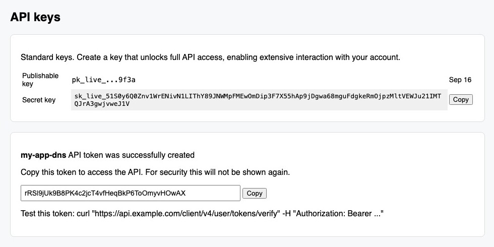
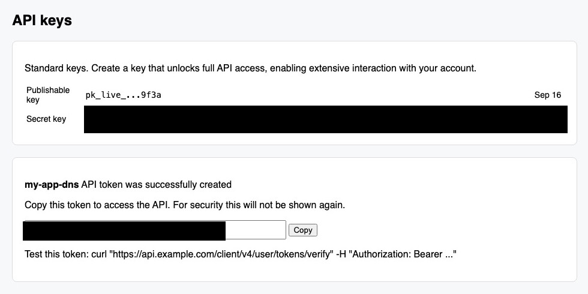
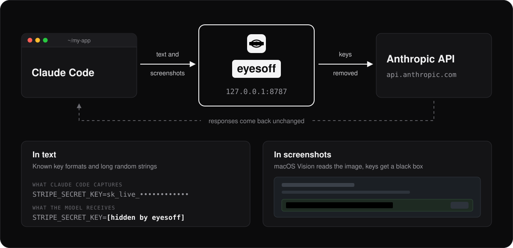

<div align="center">


# eyesoff

**Let your coding agent set up API keys without ever seeing them.**

<br>


[](https://github.com/Teeermi/eyesoff/actions/workflows/ci.yml)

</div>

<br>

<table align="center">
<tr>
<td align="center" width="50%">
  
  <br>
  <strong>What Claude Code captures</strong>
</td>
<td align="center" width="50%">
  
  <br>
  <strong>What the model receives</strong>
</td>
</tr>
</table>

<p align="center">
A small local proxy between Claude Code and the Anthropic API.<br>
It strips secrets out of text and screenshots before anything leaves your machine.
</p>

<br>

<div align="center">

## Quick start

</div>

Install the plugin in Claude Code:

```
/plugin marketplace add Teeermi/eyesoff
/plugin install eyesoff@eyesoff
```

Then tell Claude:

```
set up eyesoff
```

Claude downloads the eyesoff binary, starts the proxy and points Claude Code at it in `~/.claude/settings.json`. Restart Claude Code and you're done. From then on the plugin starts the proxy when a session begins, in case it isn't running, and gives Claude the rules for handling keys.

<br>

---

<br>

<div align="center">

## Features

</div>

<table align="center">
<tr>
<td width="50%" valign="top">

### Text
- **57 known key formats** from Stripe, GitHub, OpenAI, AWS and more, listed in [`prefixes.txt`](prefixes.txt)
- **Long random strings** with digits and mixed case, even without a known prefix
- **`cat .env`** comes back as `STRIPE_SECRET_KEY=[hidden by eyesoff]`

### Screenshots
- **On-device OCR** with the macOS Vision framework
- **Black boxes** over anything that looks like a key, including keys wrapped over two lines
- **Fails closed**: a screenshot that can't be checked is replaced with a note

</td>
<td width="50%" valign="top">

### Keys never enter the chat
- **`eyesoff paste NAME --env .env`** writes the clipboard into a file and clears the clipboard
- **`eyesoff paste NAME -- command`** pipes the clipboard into a command's stdin
- The model only sees `STRIPE_SECRET_KEY saved to .env (107 chars), clipboard cleared`

### Small and strict
- **One Rust binary**, tested in CI on macOS, Linux and Windows
- **No API key needed**, works with a claude.ai subscription login
- **Nothing goes out unchecked**: if eyesoff isn't running, Claude Code can't reach the API

</td>
</tr>
</table>

<br>

---

<br>

<div align="center">

## How it works

<br>



</div>

<br>

1. You: "create a restricted Stripe key and add it to .env as STRIPE_SECRET_KEY".
2. The agent opens the dashboard and creates the key. The screenshot it takes has the key covered before it leaves your machine.
3. The agent clicks Copy. The key is now in your clipboard, and the model has no view of that.
4. The agent runs `eyesoff paste STRIPE_SECRET_KEY --env .env`. eyesoff writes the clipboard into the file, clears the clipboard and prints `STRIPE_SECRET_KEY saved to .env (107 chars), clipboard cleared`. That line is all the model gets back.
5. If the agent reads `.env` later, it sees `STRIPE_SECRET_KEY=[hidden by eyesoff]`.

<br>

---

<br>

<div align="center">

## Install without the plugin

</div>

**macOS and Linux**

```sh
curl -fsSL https://raw.githubusercontent.com/Teeermi/eyesoff/main/install.sh | sh
```

**Windows** (PowerShell)

```powershell
irm https://raw.githubusercontent.com/Teeermi/eyesoff/main/install.ps1 | iex
```

**From source**

```sh
cargo install --git https://github.com/Teeermi/eyesoff
```

Start the proxy and leave it running:

```sh
eyesoff start
```

Point Claude Code at it in `~/.claude/settings.json`:

```json
{
  "env": {
    "ANTHROPIC_BASE_URL": "http://127.0.0.1:8787"
  },
  "permissions": {
    "deny": ["Bash(pbpaste *)"]
  }
}
```

Tell the agent how to handle keys, for example in `~/.claude/CLAUDE.md`:

```
Never print or read secret values, and never read the clipboard.
To store a key from a web dashboard, click its Copy button and run
`eyesoff paste NAME --env .env`. To send it to a command that reads stdin,
run `eyesoff paste NAME -- <command>`, e.g. `eyesoff paste API_TOKEN -- wrangler secret put API_TOKEN`.
```

<br>

---

<br>

<div align="center">

## Commands

</div>

`eyesoff start [--port 8787]` runs the proxy. Each request gets one log line, with a note when something was hidden:

```
POST /v1/messages?beta=true 200  hid 2 strings, 1 screenshot
```

`eyesoff paste NAME --env FILE` puts the clipboard into `FILE` as `NAME=value`. An existing `NAME=` line is replaced, anything else is left alone. New files are created with mode 600.

`eyesoff paste NAME -- command [args]` pipes the clipboard into the command's stdin. If the command fails, the clipboard is kept so you can try again.

<br>

---

<br>

<div align="center">

## FAQ

</div>

<details>
<summary><b>What doesn't eyesoff protect against?</b></summary>
<br>

It keeps secrets from leaking by accident. It is not a sandbox.

- Detection is a heuristic. It catches the known prefixes in [`prefixes.txt`](prefixes.txt) and strings of 20+ characters with digits and mixed case. A short token with no known prefix will get through.
- It also hides things that aren't secrets, like some hashes and base64. The agent sees `[hidden by eyesoff]` and usually works around it.
- OCR can miss text that is tiny, rotated or broken up in odd ways.
- An agent that really wants a key can still get it out, for example by encoding it first. eyesoff won't stop that.
- Clipboard managers keep history. Exclude your browser in yours, or delete the entry.
- Claude Code's local transcripts in `~/.claude` still contain the original screenshots and output. Only what goes to the API is cleaned.

</details>

<details>
<summary><b>Are screenshots checked on Linux and Windows?</b></summary>
<br>
Not yet. OCR uses the macOS Vision framework, so on Linux and Windows every screenshot is removed from the request instead of checked. Text filtering works the same everywhere.
</details>

<details>
<summary><b>Why can't Claude Code reach the API when eyesoff is off?</b></summary>
<br>
That's on purpose: nothing goes out unchecked. With the plugin installed, eyesoff is started for you when a session begins. Without it, run <code>eyesoff start</code> first.
</details>

<details>
<summary><b>Can I use the Chrome side panel?</b></summary>
<br>
No. Drive the browser from Claude Code (the Claude in Chrome integration). The side panel talks to Anthropic on its own and never goes through eyesoff.
</details>

<details>
<summary><b>How do I uninstall it?</b></summary>
<br>
Remove <code>ANTHROPIC_BASE_URL</code> from <code>~/.claude/settings.json</code> first, otherwise Claude Code can't reach the API once eyesoff is gone. Then run <code>/plugin uninstall eyesoff@eyesoff</code> and delete the binary: <code>~/.local/bin/eyesoff</code> on macOS and Linux, <code>%LOCALAPPDATA%\Programs\eyesoff</code> on Windows.
</details>

<details>
<summary><b>My provider's keys aren't hidden. How do I add them?</b></summary>
<br>
Adding a provider is a single line in <a href="prefixes.txt"><code>prefixes.txt</code></a>. See <a href="CONTRIBUTING.md">CONTRIBUTING.md</a>.
</details>

<br>

---

<br>

<div align="center">

[](CONTRIBUTING.md)
[](https://github.com/Teeermi/eyesoff/issues)
[](LICENSE)

<br>

Developed by [Teeermi](https://github.com/Teeermi)

</div>
